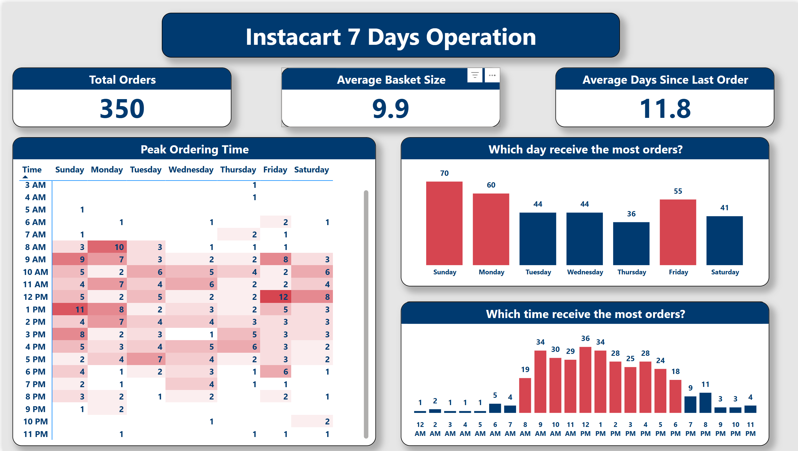
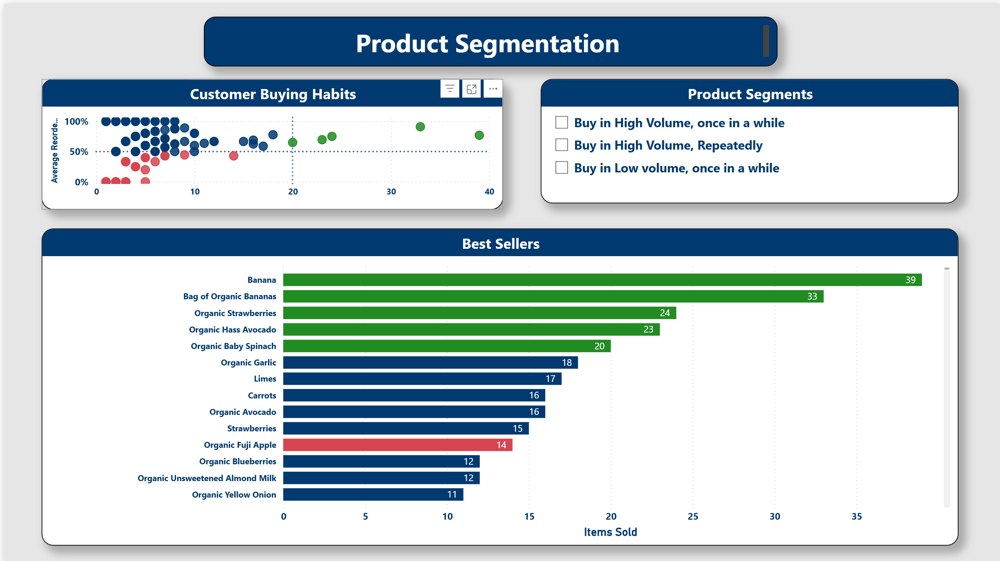

# Instacart Operations Analytics Pipeline

An automated data pipeline that processes grocery orders daily, transforms raw data into analytics-ready tables, and delivers operational insights through interactive dashboards.

---
## [] Full Pipeline Walkthrough

## Business Objective

This pipeline processes Instacart grocery order data to support operational decisions around inventory, staffing, and promotions. It demonstrates how production data systems handle real-world requirements:

- **Incremental processing** — extract only new data each day, not full reloads
- **Idempotent loads** — safe to rerun or backfill without creating duplicates
- **Layered transformations** — separate data cleaning from business logic
- **Automated orchestration** — scheduled runs with error handling and retries

> **Note:** The source dataset (3.4M orders) was scaled to 3K orders across 60 days to create realistic incremental processing scenarios for development and testing.

---

## Architecture

The pipeline runs inside Docker containers with volume mounts connecting the Windows host filesystem to the containerized environment.

**Data Flow:**
- Python scripts extract data from CSV files and load to Snowflake's RAW layer
- dbt transforms data through staging (cleaning) and marts (dimensional models)
- Power BI queries the marts directly for visualization

**Control Plane:**
- Airflow orchestrates the entire workflow — triggering extraction, loading, transformation, and testing in sequence
- Scheduled daily with retry logic and error handling

---

## Tech Stack

---

## Key Features

---

## Data Model

The fact table (`fct_order_products`) captures each line item in an order, linking to dimension tables for product and order context. This structure supports efficient queries for basket analysis, reorder patterns, and temporal trends.

---

## Design Decisions

---

## Project Structure

---

## Dashboard

The pipeline delivers operational insights through a two-page Power BI dashboard.

### Operations Overview

- **KPIs**: 350 orders processed, 9.9 average basket size, 11.8 days between orders
- **Peak Ordering Time**: Heatmap reveals busiest hours × days (Sunday 1 PM, Friday noon)
- **Temporal Patterns**: Sunday leads with 70 orders; peak hours are 10 AM – 2 PM

### Product Segmentation

- **Customer Buying Habits**: Scatter plot segments products by volume (X) vs reorder rate (Y)
- **Strategic Segments**:
  - 🟢 Green: High volume + high reorder — priority stock (Banana, Organic Strawberries)
  - 🔵 Blue: High volume + lower reorder — popular but not habit-forming
  - 🔴 Red: Lower volume — long tail products
- **Key Insight**: Organic products dominate the top sellers

---

## Data Source

[Instacart Market Basket Analysis](https://www.kaggle.com/c/instacart-market-basket-analysis) — Kaggle dataset containing 3.4M grocery orders from 200K+ users.

---

## 📧 Contact & Links

**GitHub:** [github.com/mrluke269]  
**Email:** [luke.trmai@gmail.com]
### 

**Luke M**

